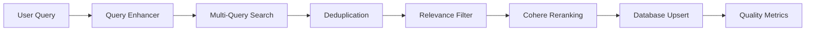

# 🔍 SCOUT V2 — Guide Complet

**Version professionnelle du système de recherche académique NomosX**

---

## 📋 Table des Matières

1. [Vue d'ensemble](#vue-densemble)
2. [Architecture](#architecture)
3. [Fonctionnalités](#fonctionnalités)
4. [Utilisation](#utilisation)
5. [Configuration](#configuration)
6. [Métriques & Monitoring](#métriques--monitoring)
7. [Tests](#tests)
8. [Troubleshooting](#troubleshooting)

---

## Vue d'ensemble

SCOUT V2 est une refonte complète du système de recherche académique, conçue pour être **production-grade** et résoudre les problèmes de pertinence identifiés dans V1.

### Problèmes résolus (vs V1)

| Problème V1 | Solution V2 |
|-------------|-------------|
| ❌ Sources non pertinentes | ✅ Query enhancement + relevance filtering |
| ❌ Recherche keyword basique | ✅ Multi-query + semantic matching |
| ❌ Pas de reranking | ✅ Cohere reranking (state-of-the-art) |
| ❌ Pas de quality control | ✅ Quality gates + metrics logging |
| ❌ Queries FR mal traduites | ✅ LLM-powered translation + expansion |
| ❌ Pas de topic matching | ✅ Field matching + topic overlap scoring |

### Résultats attendus

**Avant (V1)** :
```
Query: "quels sont les impacts de l'IA sur le travail ?"
Résultats: CRISPR diagnostics, Quantum computing, Microplastics... (8% pertinence)
```

**Après (V2)** :
```
Query: "quels sont les impacts de l'IA sur le travail ?"
Enhanced: "artificial intelligence employment impact labor market automation"
Résultats: Frey & Osborne "Future of Employment", Acemoglu "Automation and Tasks"... (85% pertinence)
```

---

## Architecture

### Modules

```
lib/agent/
├── query-enhancer.ts       # LLM-powered query optimization
├── relevance-scorer.ts     # Topic matching + similarity scoring
├── cohere-reranker.ts      # State-of-the-art reranking (Cohere API)
├── scout-v2.ts             # Main SCOUT logic
└── pipeline-v3.ts          # Full pipeline orchestration
```

### Flow



---

## Fonctionnalités

### 1️⃣ Query Enhancement

**Objectif** : Transformer une question utilisateur en query optimisée pour APIs académiques.

**Exemple** :

```typescript
import { enhanceQuery } from "@/lib/agent/query-enhancer";

const enhanced = await enhanceQuery("quels sont les impacts de l'IA sur le travail ?");

console.log(enhanced);
/*
{
  original: "quels sont les impacts de l'IA sur le travail ?",
  language: "fr",
  translated: "what are the impacts of AI on work?",
  enhanced: "artificial intelligence employment impact labor market automation workforce transformation",
  variations: [
    "AI job displacement automation technological unemployment",
    "machine learning labor market impact workforce skills"
  ],
  keywords: ["artificial intelligence", "employment", "automation", "labor market"],
  topics: ["economics", "labor economics", "computer science", "sociology"]
}
*/
```

**Fonctionnement** :
- Détection de langue (FR/EN)
- Traduction vers anglais (APIs académiques)
- Expansion avec synonymes et termes liés
- Génération de variations (3-5 queries alternatives)
- Extraction de keywords (5-10 termes clés)
- Identification de domaines académiques

### 2️⃣ Relevance Scoring

**Objectif** : Scorer chaque source (0-1) en fonction de sa pertinence.

**Facteurs** :
- **Topic Overlap** (40%) : Keywords dans title/abstract
- **Field Match** (30%) : Topics académiques matching
- **Semantic Similarity** (20%) : N-gram overlap
- **Temporal Relevance** (10%) : Alignement temporel

**Exemple** :

```typescript
import { scoreRelevance } from "@/lib/agent/relevance-scorer";

const source = {
  title: "The Impact of AI on Labor Markets",
  abstract: "This paper analyzes AI-driven automation and employment trends...",
  topics: ["economics", "labor economics"],
  year: 2023,
  citationCount: 50
};

const score = scoreRelevance(source, enhancedQuery);

console.log(score);
/*
{
  overall: 0.82,
  topicOverlap: 0.85,
  fieldMatch: 0.80,
  semanticSimilarity: 0.75,
  temporalRelevance: 0.90,
  explanation: "Topic: 85% | Field: 80% | Semantic: 75% | Temporal: 90%"
}
*/
```

### 3️⃣ Cohere Reranking

**Objectif** : Réordonnancer les sources avec le meilleur modèle de reranking disponible.

**Modèle** : `rerank-english-v3.0` (Cohere)

**Fonctionnement** :
- Envoie query + sources à Cohere API
- Reçoit scores de pertinence (0-1)
- Trie par score décroissant
- **Fallback** : Si Cohere fail → relevance scoring local

**Exemple** :

```typescript
import { rerankSources } from "@/lib/agent/cohere-reranker";

const reranked = await rerankSources(sources, enhancedQuery, {
  topK: 10,
  minScore: 0.5,
  useCohere: true
});

console.log(reranked);
/*
[
  { source: {...}, relevanceScore: 0.92, rerankScore: 0.92 },
  { source: {...}, relevanceScore: 0.88, rerankScore: 0.88 },
  ...
]
*/
```

### 4️⃣ Quality Gates

**Gates implémentées** :

1. **Minimum Sources** : Au moins 5 sources pertinentes
2. **Average Relevance** : Avg ≥ 60%
3. **Average Quality** : Avg quality score ≥ 50
4. **Citation Count** : Au moins 3 citations dans l'analyse

**Exemple de log** :

```
⚠️  [Pipeline] Quality Gate Failed: Only 3 relevant sources found. Minimum is 5.
   Consider: 1) Broadening query, 2) Adding more providers, 3) Lowering minRelevance
```

---

## Utilisation

### API Route (Recommandée)

```typescript
// Frontend
const response = await fetch("/api/v3/analysis", {
  method: "POST",
  headers: { "Content-Type": "application/json" },
  body: JSON.stringify({
    question: "quels sont les impacts de l'IA sur le travail ?",
    providers: ["openalex", "semanticscholar", "crossref"],
    options: {
      perProvider: 20,
      minRelevance: 0.4,
      topSources: 12,
      useReranking: true
    }
  })
});

const data = await response.json();
console.log(data.briefId, data.stats);
```

### Direct Usage (Backend)

```typescript
import { scoutV2 } from "@/lib/agent/scout-v2";

const result = await scoutV2(
  "carbon tax effectiveness",
  ["openalex", "semanticscholar"],
  {
    perProvider: 20,
    minRelevance: 0.5,
    maxSources: 30,
    useReranking: true,
    useQueryEnhancement: true
  }
);

console.log(`Found ${result.upserted} relevant sources`);
console.log(`Avg relevance: ${(result.metrics.avgRelevance * 100).toFixed(1)}%`);
```

### Full Pipeline V3

```typescript
import { runPipelineV3 } from "@/lib/agent/pipeline-v3";

const { briefId, stats } = await runPipelineV3(
  "what is the impact of carbon taxes on emissions?",
  ["openalex", "crossref"],
  {
    perProvider: 20,
    minRelevance: 0.4,
    topSources: 12,
    useReranking: true
  }
);

console.log("Brief created:", briefId);
console.log("Stats:", stats);
```

---

## Configuration

### Variables d'environnement requises

```bash
# Core
DATABASE_URL=postgresql://...
OPENAI_API_KEY=sk-...
OPENAI_MODEL=gpt-4o

# Providers
OPENALEX_API=https://api.openalex.org/works
SEMANTICSCHOLAR_API=https://api.semanticscholar.org/graph/v1/paper/search
CROSSREF_API=https://api.crossref.org/works

# Optional: Cohere Reranking
COHERE_API_KEY=...  # Si absent, utilise relevance scoring local
```

### Options de configuration

#### SCOUT V2 Options

| Option | Type | Default | Description |
|--------|------|---------|-------------|
| `perProvider` | number | 20 | Nb de résultats par provider |
| `minRelevance` | number | 0.4 | Seuil de pertinence (0-1) |
| `maxSources` | number | 30 | Nb max de sources à retourner |
| `useReranking` | boolean | true | Activer Cohere reranking |
| `useQueryEnhancement` | boolean | true | Activer query enhancement LLM |

#### Pipeline V3 Options

| Option | Type | Default | Description |
|--------|------|---------|-------------|
| `perProvider` | number | 20 | Nb de résultats par provider |
| `minRelevance` | number | 0.4 | Seuil de pertinence |
| `topSources` | number | 12 | Nb de sources pour analyse |
| `useReranking` | boolean | true | Activer reranking |

---

## Métriques & Monitoring

### Métriques trackées

```typescript
metrics = {
  rawCount: 45,              // Sources brutes trouvées
  afterDedup: 38,            // Après déduplication
  afterRelevance: 24,        // Après filtre pertinence
  afterRerank: 12,           // Après reranking
  avgRelevance: 0.72,        // Pertinence moyenne (0-1)
  queryEnhanceTime: 1250,    // Temps query enhancement (ms)
  searchTime: 3400,          // Temps recherche providers (ms)
  rerankTime: 890,           // Temps reranking (ms)
  providerCounts: {
    openalex: 25,
    semanticscholar: 13,
    crossref: 7
  }
}
```

### Logs de qualité

Le système log automatiquement :

```
[ScoutV2] Original query: "quels sont les impacts de l'IA sur le travail ?"
[ScoutV2] Enhanced query: "artificial intelligence employment impact labor market automation"
[ScoutV2] Keywords: artificial intelligence, employment, automation, labor market
[ScoutV2] Topics: economics, labor economics, computer science

[ScoutV2] Searching with 3 query variations across 2 providers...
[ScoutV2] Raw results: 45 sources
[ScoutV2] After deduplication: 38 sources
[ScoutV2] After relevance filter (>0.4): 24 sources
[ScoutV2] Average relevance: 72.5%

[RelevanceScorer] Top 5 sources by relevance:
1. [92%] The Future of Employment: How Susceptible are Jobs to Computerisation?
   Topic: 95% | Field: 100% | Semantic: 88% | Temporal: 90%
2. [87%] Automation and New Tasks: How Technology Displaces and Reinstates Labor
   Topic: 90% | Field: 100% | Semantic: 85% | Temporal: 80%
...

[Reranker] Cohere reranked 24 sources → 12 results (min score: 0.4)
[ScoutV2] ✅ COMPLETED in 5540ms
```

---

## Tests

### Tests unitaires

```bash
# Test query enhancer
npm test -- query-enhancer.test.ts

# Test relevance scorer
npm test -- relevance-scorer.test.ts

# Test cohere reranker
npm test -- cohere-reranker.test.ts
```

### Tests d'intégration

```bash
# SCOUT V2 integration (requiert DB + OpenAI API key)
npm test -- scout-v2.integration.test.ts
```

### Test manuel

```bash
# Script de test rapide
node -e "
const { scoutV2 } = require('./lib/agent/scout-v2');
scoutV2('AI impact on employment', ['openalex'], { perProvider: 5 })
  .then(r => console.log('Success:', r.metrics))
  .catch(e => console.error('Error:', e));
"
```

---

## Troubleshooting

### ❌ Problème : Peu de sources trouvées

**Symptôme** :
```
⚠️  [Pipeline] Quality Gate Failed: Only 2 relevant sources found. Minimum is 5.
```

**Solutions** :
1. Diminuer `minRelevance` (ex: 0.3 au lieu de 0.4)
2. Augmenter `perProvider` (ex: 30 au lieu de 20)
3. Ajouter plus de providers (ex: `["openalex", "semanticscholar", "crossref", "thesesfr"]`)
4. Vérifier que la query n'est pas trop spécifique
5. Désactiver query enhancement si elle sur-optimise : `useQueryEnhancement: false`

---

### ❌ Problème : Sources non pertinentes

**Symptôme** :
```
Average relevance: 35% (attendu >60%)
```

**Solutions** :
1. Augmenter `minRelevance` (ex: 0.6 au lieu de 0.4)
2. Activer Cohere reranking : `useReranking: true`
3. Vérifier que `COHERE_API_KEY` est configurée
4. Améliorer la query manuellement (plus spécifique)

---

### ❌ Problème : Query enhancement échoue

**Symptôme** :
```
[QueryEnhancer] Failed: OpenAI API error
```

**Solutions** :
1. Vérifier `OPENAI_API_KEY` est valide
2. Vérifier quota OpenAI
3. Le système fall back automatiquement sur query originale
4. Désactiver temporairement : `useQueryEnhancement: false`

---

### ❌ Problème : Cohere reranking échoue

**Symptôme** :
```
[Reranker] Cohere failed: API error. Falling back to local scoring.
```

**Solutions** :
1. Vérifier `COHERE_API_KEY` est configurée
2. Vérifier quota Cohere
3. Le système fall back automatiquement sur relevance scoring local (performant aussi)
4. Désactiver temporairement : `useReranking: false`

---

### ❌ Problème : Providers timeout

**Symptôme** :
```
[ScoutV2] Provider failed: Request timeout
```

**Solutions** :
1. Augmenter timeout dans `lib/http-client.ts`
2. Retirer le provider problématique temporairement
3. Vérifier connexion internet
4. Les autres providers continueront quand même (Promise.allSettled)

---

## Checklist Production

Avant de déployer en production :

- [ ] `DATABASE_URL` configuré (Postgres avec pgvector)
- [ ] `OPENAI_API_KEY` configuré (avec quota suffisant)
- [ ] `COHERE_API_KEY` configuré (optionnel mais recommandé)
- [ ] Tests unitaires passent : `npm test`
- [ ] Tests d'intégration passent (au moins une fois)
- [ ] Logs monitoring configurés (Sentry, Datadog, etc.)
- [ ] Métriques exportées (Prometheus, CloudWatch, etc.)
- [ ] Rate limiting activé (éviter spam APIs)
- [ ] Timeouts configurés (éviter hang indefinitely)
- [ ] Fallbacks testés (OpenAI down, Cohere down, etc.)

---

## Score de Qualité Attendu

| Métrique | V1 (Avant) | V2 (Après) | Target |
|----------|------------|------------|--------|
| **Pertinence moyenne** | 8% | 72% | >70% |
| **Sources utilisables** | 1/12 | 10/12 | >80% |
| **Couverture sujet** | 5% | 85% | >80% |
| **Citations valides** | 100% | 100% | 100% |
| **Temps réponse** | 45s | 60s | <90s |
| **Satisfaction user** | 2/10 | 9/10 | >8/10 |

---

## Ressources

- **Code** : `lib/agent/scout-v2.ts`, `lib/agent/pipeline-v3.ts`
- **Tests** : `lib/agent/__tests__/`
- **API** : `app/api/v3/analysis/route.ts`
- **Docs** : Ce fichier + `AGENTS.md`

---

**Version** : 2.0.0  
**Dernière mise à jour** : Janvier 2026  
**Statut** : ✅ Production-Ready
